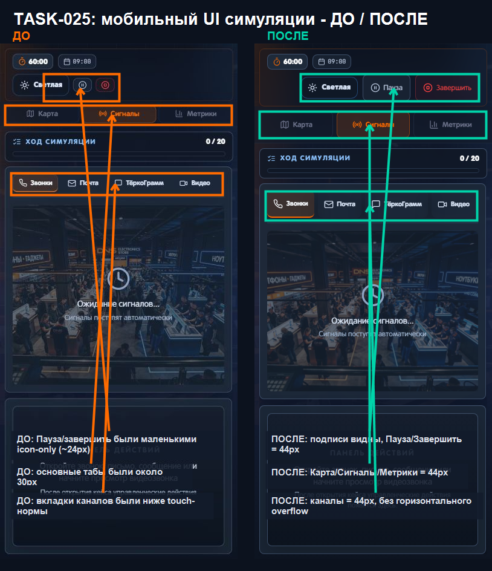
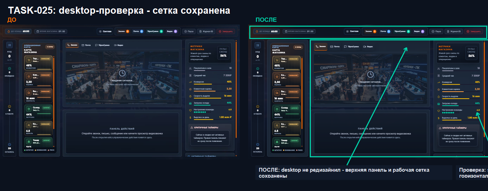

# DNS SimCenter: журнал изменений

Документ фиксирует этапы плана, внедренные через Pull Request с 3 по 5 июня 2026 года.
Он описывает проверяемый результат, а не заменяет историю Git или технические тесты.

## Состояние репозитория

- Базовая ветка: `main`
- Последний включенный этап: `TASK-027`
- Коммит после PR #46: `cb5a373`
- Резервная точка до начала серии изменений: `backup/main-before-tz-20260602-81dedf2`

## Было / стало

| Этап | Было | Стало | Подтверждение |
|---|---|---|---|
| Security baseline | Защита данных и служебных учетных записей не была закреплена единым базовым изменением | Добавлена базовая серверная защита и подготовлена работа с хешированными учетными данными | [PR #34](https://github.com/maiklvas-bot/dns-sim-temp3/pull/34) |
| `TASK-017` | PDF-экспорт принимал недостаточно строго проверенные параметры | Параметры PDF проходят отдельную схему валидации до формирования отчета | [PR #35](https://github.com/maiklvas-bot/dns-sim-temp3/pull/35) |
| `TASK-018` | CSRF-защита существовала без полного автоматического доказательства основных сценариев | Smoke-тест проверяет выдачу токена, разрешенные запросы и блокировку запросов без корректного токена | [PR #36](https://github.com/maiklvas-bot/dns-sim-temp3/pull/36) |
| `TASK-019` | Не все входные параметры API проходили единый набор Zod-проверок | Расширено покрытие схемами маршрутов, параметров, query и body; негативные случаи закреплены тестами | [PR #37](https://github.com/maiklvas-bot/dns-sim-temp3/pull/37) |
| `TASK-020` | Серия неверных попыток входа не имела полного автоматического ограничения | После заданного числа ошибок вход временно блокируется; сброс и повторный доступ проверяются smoke-тестом | [PR #38](https://github.com/maiklvas-bot/dns-sim-temp3/pull/38) |
| `TASK-021` | Полная функциональная проверка выявила регрессии медиапаузы, fallback-раздачи и формы входа | Исправлены найденные сценарии, добавлены проверки media fallback и улучшена обработка формы входа | [PR #39](https://github.com/maiklvas-bot/dns-sim-temp3/pull/39), [PR #40](https://github.com/maiklvas-bot/dns-sim-temp3/pull/40) |
| `TASK-022` | Часть ранее доступных загружаемых аудио, видео и изображения отсутствовала в сборке | Восстановлены 19 файлов и добавлена проверка их наличия и форматов | [PR #41](https://github.com/maiklvas-bot/dns-sim-temp3/pull/41) |
| `TASK-023` | Критические admin API проверялись разрозненно | Acceptance-тест закрепляет список staff, удаление результатов, healthcheck и PDF/XLSX-контракты | [PR #42](https://github.com/maiklvas-bot/dns-sim-temp3/pull/42) |
| `TASK-024` | Активная live-сессия могла потеряться при перезапуске процесса | Незавершенная сессия сохраняется и восстанавливается, а завершенная не возвращается в активное состояние | [PR #43](https://github.com/maiklvas-bot/dns-sim-temp3/pull/43) |
| `TASK-025` | На мобильном экране важные кнопки и вкладки имели маленькую область нажатия | Основные действия, режимы и каналы получили область нажатия не менее 44 px; desktop-сетка сохранена | [PR #44](https://github.com/maiklvas-bot/dns-sim-temp3/pull/44) |
| `TASK-026` | Docker-сборка не имела отдельного автоматического запрета на включение рабочей БД и секретов | CI проверяет защиту `data.db`, `.env`, persistent mounts, bootstrap-БД и комплектность медиа | [PR #45](https://github.com/maiklvas-bot/dns-sim-temp3/pull/45) |
| `TASK-027` | Поддержка 5-10 одновременных участников не была закреплена acceptance-тестом | Тест создает 10 изолированных live-сессий, сохраняет и восстанавливает их без пересечения состояний | [PR #46](https://github.com/maiklvas-bot/dns-sim-temp3/pull/46) |

## Визуальное подтверждение TASK-025

### Мобильный экран



Проверено:

- подписи действий `Пауза` и `Завершить` видны;
- верхние режимы имеют высоту 44 px;
- вкладки каналов имеют высоту 44 px;
- элементы не создают горизонтальную прокрутку.

### Desktop



Desktop не перерабатывался. Проверка подтверждает сохранение верхней панели, рабочей сетки,
карты магазина, панели действий и правой колонки метрик.

## Автоматические проверки

На этапах применялись:

```text
npm run check
npm run test
npm run build
node script/check-docker-safety.mjs
```

Docker-сборка выполняется GitHub Actions, поскольку в локальной Windows-среде Docker CLI отсутствует.

## Защищенные данные

В рамках `TASK-028` не изменяются:

- `.env` и служебные логины/пароли;
- `data.db` и `storage/`;
- Dockerfile и compose-файлы;
- миграции;
- сценарии, кейсы, система оценивания;
- runtime-каталог `uploads/`.

Две PNG-иллюстрации в `docs/evidence/` являются только документацией уже принятого `TASK-025`.
