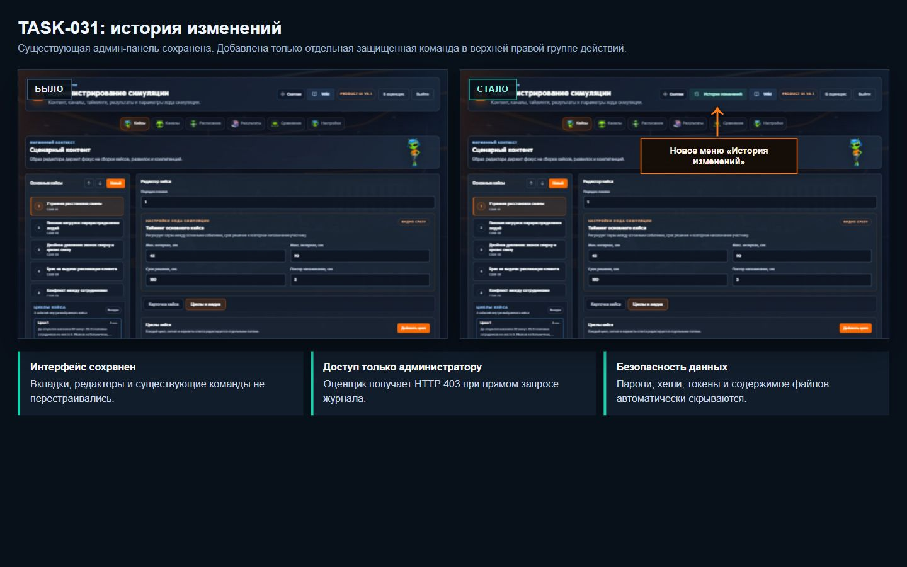
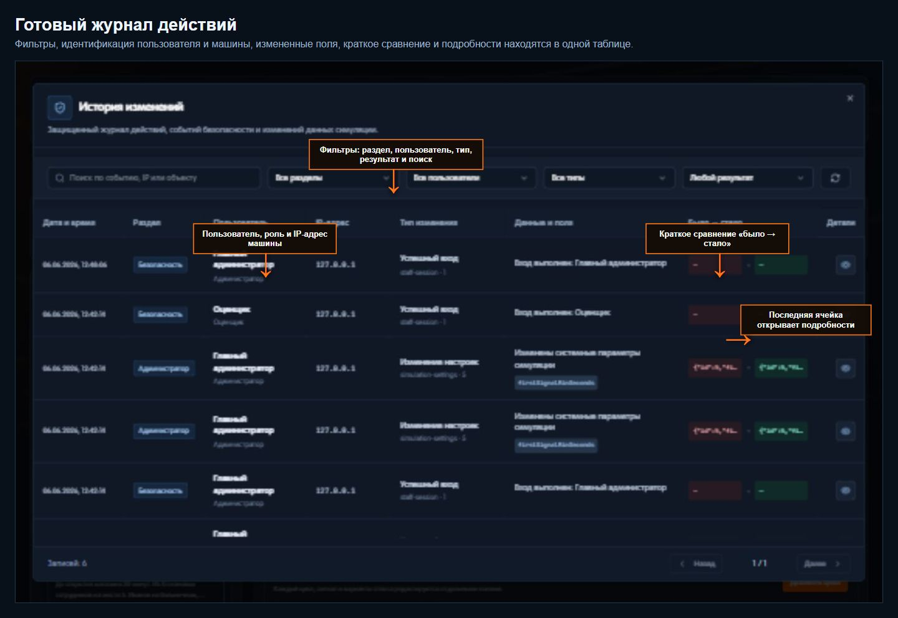
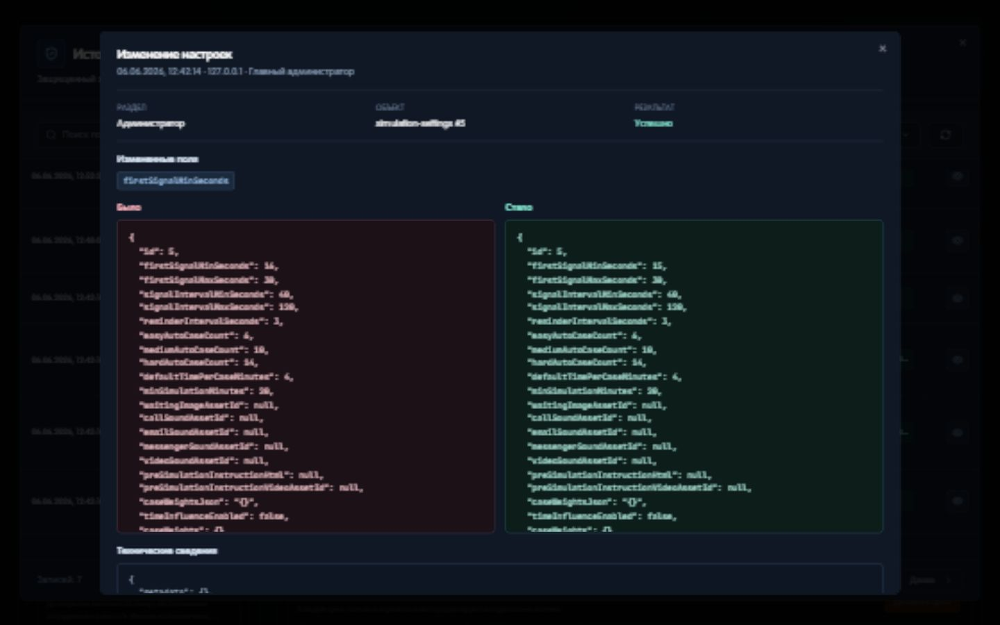

# TASK-031: журнал изменений

## Объем изменения

- в верхней панели администратора добавлена отдельная кнопка `История изменений`;
- журнал доступен только администратору и дополнительно защищен серверной проверкой роли;
- сохраняются события безопасности, административные изменения, действия оценщика и события симуляции;
- журнал фиксирует пользователя, роль, IP-адрес, действие, область данных, измененные поля, состояние до и после;
- доступны фильтры по области, пользователю, типу действия, результату и текстовый поиск;
- крайняя колонка открывает подробности с данными `Было` и `Стало`.

## Защита данных

- пароли, хеши паролей, токены, cookie, коды доступа и секреты заменяются значением `[REDACTED]`;
- двоичное содержимое загруженных файлов в журнал не записывается;
- `.env`, `data.db`, существующие учетные записи и медиаресурсы не изменялись;
- попытка пользователя без роли администратора открыть административный маршрут возвращает `403` и записывается как событие безопасности.

## Визуальное подтверждение

### Было / стало



### Журнал и фильтры



### Подробности изменения



## Проверки

```text
npm run check
npm run test
npm run build
node script/check-docker-safety.mjs
git diff --check
```

Дополнительно выполнена приемочная проверка на изолированной копии базы:

- администратор получает журнал через API;
- изменение настройки появляется в журнале со старым и новым значением;
- оценщик получает `403`;
- отказ в административном доступе появляется в событиях безопасности;
- тестовая настройка возвращается к исходному значению.
